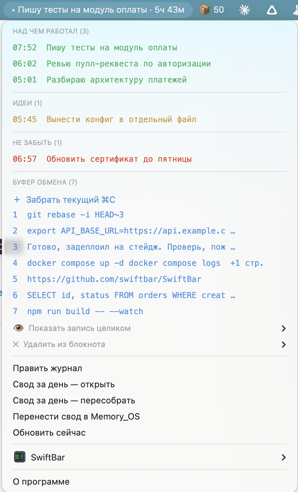

# VibeBar

## Modular cross-platform fork

This branch preserves Margulan Seissembayev's original journal format, time
model and macOS scripts, and adds a modular Windows/macOS product layer. Major
extensions include a native Windows interface, Russian/English/Hebrew language
packs, user-defined voice commands, local `Hey Computer` activation,
`whisper.cpp` support, achievement notes, post-hoc task categories, Bluetooth
absence detection with a five-minute retroactive break rule, safe Null adapters
and cross-platform tests.

- [Watch the Russian presentation](video/vibebar-russian-demo.mp4)
- [Read the complete Russian feature comparison](video/description-ru.md)
- [Windows installation](windows/README.md)
- [macOS modular installation](macos/README.md)
- [Architecture and safety rules](ARCHOV.md)

The original work and its four core tools are credited below. This fork's
extensions are documented separately so that original and added work remain
clear.

---

**English** · A macOS menu-bar app. Say what you're doing — it logs itself. Four tools in one menu:

| | |
|---|---|
| **Task tracker** | Hit a hotkey, say what you're working on. It shows in the menu bar with a running timer; the next phrase closes the previous task. Durations are derived from the gaps — nothing to start or stop. |
| **Ideas** | Say "идея / idea …" and the thought goes to its own list without touching the current task. |
| **Reminders** | Say "не забыть / remind …" and it lands in a red list, becoming a checkbox in the daily digest. |
| **Clipboard manager** | Your last 15 copies, one click to paste any of them back. Copied terminal sessions get the shell prompt stripped automatically, and output is wrapped in a code fence for pasting into a chat. |

Daily and weekly digests with time totals are generated automatically and can be appended to an Obsidian note on a schedule.

Requires [SwiftBar](https://github.com/swiftbar/SwiftBar) (free), [macrowhisper](https://github.com/ognistik/macrowhisper) (free) and [superwhisper](https://superwhisper.com) — **paid**, with a limited free tier. The clipboard manager alone works with SwiftBar only.

Install order matters: install the dependencies, run `macrowhisper --start-service` once so it writes its config, then `git clone` → `./install.sh`. Three steps stay manual — SwiftBar plugin folder, the superwhisper mode, and the Accessibility permission; the installer prints them at the end.

Everything runs locally, nothing leaves your machine. Trigger words are configurable — the defaults are Russian. Docs below are in Russian; open an issue if you need them in English.

---

**Четыре инструмента в одном пункте меню-бара: трекер задач, копилка идей, напоминания и менеджер буфера обмена.**



### 1. Трекер задач

Нажал горячую клавишу, сказал «работаю над схемой вознаграждения» — запись легла в журнал, а в строке меню появилось, чем ты занят, и таймер. Следующая фраза автоматически закрывает предыдущую задачу: длительность считается из интервалов между записями, останавливать ничего не надо. К вечеру виден честный расклад дня по часам.

### 2. Идеи

Мысль приходит посреди работы и мешает. Говоришь «идея, вынести факт в отдельную таблицу» — она уходит в отдельный жёлтый блок и **не сбивает текущую задачу**. Таймер продолжает идти, голова свободна.

### 3. Напоминания

«Не забыть позвонить Руслану до пятницы» — попадает в красный блок «не забыть». В сводке за день такие пункты становятся чекбоксами, которые можно отмечать. Это не полноценный todo-менеджер, а страховка от «вылетело из головы» в момент, когда отвлекаться нельзя.

### 4. Менеджер буфера обмена

Последние 15 копий `⌘C` лежат списком. Скопировал в одном окне, перешёл в другое, кликнул нужную — она вставилась. Особенно выручает, когда весь день гоняешь текст между LLM и терминалом: из скопированной терминальной сессии автоматически вырезается приглашение и остаётся только вывод, а при вставке в чат он оборачивается в блок кода.

### Плюс два отчёта

**Сводка за день** — таблица «начало / конец / длительность / чем занимался», итог по часам, отдельно идеи и напоминания. Пересобирается сама, пока не правишь руками; после правки фиксируется.

**Недельная сводка** — на что ушло время за 7 дней, с долями в процентах и разбивкой по дням.

Обе умеют дописываться в заметку Obsidian по расписанию: дневная в 22:00, недельная по воскресеньям.

---

## Как считается время

Модель однозадачная: в каждый момент времени идёт ровно одна задача, следующая фраза закрывает предыдущую.

1. Из журнала берутся строки вида `- ЧЧ:ММ · текст` за нужный день.
2. Идеи (`💡`) и напоминания (`❗`) исключаются — это заметки, а не события времени.
3. Оставшиеся сортируются по времени.
4. **Начало** записи — её собственное время. **Конец** — время следующей записи.
5. Последняя запись дня: если день сегодняшний — конец равен «сейчас», и в баре виден живой таймер. Если день уже прошёл, а запись не закрыта — она **не учитывается вовсе**. Иначе забытая на ночь задача превратилась бы в четырнадцать часов работы.
6. Пауза (`⏸`) закрывает предыдущую задачу, но сама времени не получает. Промежуток между паузой и следующей задачей в итог не попадает.
7. Интервалы нулевой и отрицательной длины отбрасываются.
8. Итог за день — сумма интервалов. Точность — одна минута.

Сводка каждый раз пересобирается из журнала, поэтому **правка журнала задним числом меняет расчёт**: поправил время или текст — цифры пересчитались.

### Чего эта модель не умеет

**Параллельных дел.** Если вы одновременно ведёте две работы, инструмент этого не выразит: время достанется той задаче, которую вы назвали последней. Это осознанное ограничение — параллельный учёт требует явно открывать и закрывать каждую дорожку, а это уже не голосовой журнал, а трекер с кнопками.

На практике параллельность почти всегда оказывается быстрым переключением. Если вы правда прыгаете между двумя делами — просто называйте каждое переключение, и картина будет честной. Фоновые процессы (идёт сборка, рендер, выгрузка) считать своим временем не стоит: вы в этот момент заняты другим, о нём и говорите.

## Ключевые слова

Тип записи определяется по первому слову фразы — отдельные хоткеи не нужны:

| Скажешь | Куда попадёт |
|---|---|
| `схема вознаграждения для команды` | **над чем работал** — становится текущей задачей |
| `идея` / `мысль` / `заметка` / `идею` … | **идеи** |
| `не забыть` / `напомнить` / `важно` / `запомнить` … | **не забыть** |
| `перерыв` / `пауза` / `стоп` / `обед` … | пауза, время не считается |

Регистр и знаки препинания значения не имеют. Список слов правится в `bin/vibebar-add.sh`.

Голосовая часть работает через отдельный режим superwhisper с выключенной автовставкой: сказанное уходит в журнал и **не появляется в активном окне**. Обычная диктовка при этом продолжает работать как раньше.

## Требования

| Что | Зачем | Цена |
|---|---|---|
| macOS | Apple Silicon или Intel | — |
| `python3` | вся логика на нём | уже есть в системе |
| [SwiftBar](https://github.com/swiftbar/SwiftBar) | рисует меню | бесплатно |
| [superwhisper](https://superwhisper.com) | распознаёт речь | **платный**: подписка или разовая покупка. Есть бесплатный тариф с ограничениями |
| [macrowhisper](https://github.com/ognistik/macrowhisper) | связывает superwhisper со скриптами | бесплатно, GPL-3.0 |

**Менеджер буфера обмена работает без superwhisper и macrowhisper** — если голосовая часть не нужна, хватит SwiftBar. Агенты дневной и недельной сводки при этом тоже не понадобятся.

## Установка

Порядок важен: `install.sh` дописывает действия в конфиг macrowhisper, а тот появляется только после первого запуска сервиса. Если сделать наоборот, установку придётся повторить.

**Шаг 1 — зависимости**

```bash
brew install --cask swiftbar
brew install ognistik/formulae/macrowhisper
```

superwhisper скачайте с [superwhisper.com](https://superwhisper.com) и запустите хотя бы раз.

**Шаг 2 — запустить сервис macrowhisper, чтобы он создал свой конфиг**

```bash
macrowhisper --start-service
```

**Шаг 3 — установка**

```bash
git clone https://github.com/margulans/vibebar.git
cd vibebar
./install.sh
```

Скрипт создаст `config.env`, соберёт плагин SwiftBar, поставит фоновые агенты и пропишет действия в macrowhisper, сделав резервную копию его конфига. Запускать повторно безопасно: существующий `config.env` не перезаписывается.

**Шаг 4 — то, что автоматизировать нельзя**

1. **Папка плагинов SwiftBar.** Если при установке было предупреждение — SwiftBar → Preferences → Plugin Folder → укажите папку `swiftbar` внутри репозитория.
2. **Режим superwhisper.** Settings → Modes → создайте режим с именем из `VIBEBAR_MODE_NAME` (по умолчанию `Journal`), **Auto paste = Off**, назначьте горячую клавишу. В остальных режимах Auto paste оставьте **On** — иначе обычная диктовка перестанет вставлять текст.
3. **Разрешение на автовставку.** Системные настройки → Конфиденциальность и безопасность → Универсальный доступ → добавьте SwiftBar. Без него клик по записи блокнота положит текст в буфер обмена, но не вставит его.
4. **SwiftBar → Refresh All.**

**Шаг 5 — проверка**

Нажмите горячую клавишу режима, скажите «работаю над установкой». В течение десяти секунд в меню-баре должна появиться эта фраза с таймером, а текст **не должен вставиться** в активное окно.

Удаление — `./uninstall.sh`. Журнал, сводки и блокнот остаются на месте.

## Если не работает

Проверяйте по порядку, каждый пункт отсекает свой слой.

**Ничего не появляется в меню, даже пустые блоки.** Плагин не подключён. `ls "$(defaults read com.ameba.SwiftBar PluginDirectory)"` — там должен быть `vibebar.3s.sh`. Нет — укажите папку плагинов вручную и нажмите Refresh All.

**Меню есть, но фраза не попадает в журнал.** Смотрите, дошла ли она до macrowhisper:

```bash
python3 -c 'import json,glob,os
d=sorted(glob.glob(os.path.expanduser("~/Documents/superwhisper/recordings/*/meta.json")),key=os.path.getmtime)
print("режим:", json.load(open(d[-1])).get("modeName") if d else "записей нет")'
```

Имя режима должно **в точности** совпадать с `VIBEBAR_MODE_NAME`. Не совпадает — переименуйте режим в superwhisper или поправьте переменную.

**Фраза попадает и в журнал, и в активное окно.** В режиме не выключен `Auto paste`. Либо в macrowhisper `defaults.activeAction` вставляет параллельно — должно быть `dictation`, не `autoPaste`.

**Клик по записи блокнота не вставляет.** Нет разрешения в Универсальном доступе, либо мешает раскладка. Смотрите `clip.log` в папке репозитория: там пишется, что было активным окном и сработала ли клавиша.

**В блокноте появляются собственные диктовки.** Значит macrowhisper не помечает их. Проверьте, что в его конфиге есть действие `dictation` и что `.dictations` в папке репозитория растёт.

**Кириллица превращается в `?????`.** Не выставлена локаль в окружении, в котором запускается скрипт. Проверьте, что в `bin/vibebar-buf.sh` не затёрты строки с `LANG` и `__CF_USER_TEXT_ENCODING`.

Логи: `clip.log` и `buf.log` в папке репозитория, `/tmp/com.vibebar.*.err` для агентов.

## Настройка

Всё в `config.env`, переменные окружения имеют приоритет. Главное:

| Переменная | По умолчанию | Что делает |
|---|---|---|
| `VIBEBAR_FILE` | `~/vibebar-journal.md` | журнал. Держите **вне** синхронизируемых папок |
| `VIBEBAR_VAULT_FILE` | пусто | заметка, куда переносятся сводки. Пусто — перенос выключен |
| `VIBEBAR_BUFFER_MAX` | 15 | сколько записей хранит блокнот |
| `VIBEBAR_AUTOPASTE` | 1 | клик по записи вставляет в активное окно |
| `VIBEBAR_CLEAN_TERMINAL` | 1 | срезать приглашение терминала |
| `VIBEBAR_MODE_NAME` | `Journal` | имя режима superwhisper |
| `VIBEBAR_PROMPT_RE` | под macOS | шаблон приглашения терминала — поправьте под своё |

Формат журнала — обычный markdown, правится руками:

```
## 2026-08-17
- 09:40 · схема вознаграждения для команды
- 10:15 · 💡 вынести факт в отдельную таблицу
- 11:02 · ❗ позвонить Руслану до пятницы
- 13:00 · ⏸ перерыв
```

Не ломайте время и разделитель `·` — по ним разбирают меню и сводки.

## Демо-режим

Для скриншотов и демонстраций — подменяет журнал и блокнот нейтральными примерами, чтобы в кадр не попали настоящие записи:

```bash
./bin/vibebar-demo.sh on     # → Refresh All в SwiftBar → снимаете скриншот
./bin/vibebar-demo.sh off    # возвращает ваш конфиг
```

Настоящий `config.env` сохраняется в `config.env.real` и восстанавливается командой `off`.

## Приватность

Всё лежит локально, ничего никуда не отправляется. Блокнот — обычный текстовый файл с правами `600`. Содержимое, помеченное приложением как `ConcealedType` (так метят менеджеры паролей), не забирается. Но **пароли из обычного текста туда попадут** — для них есть менеджер паролей, а не это.

## Грабли, на которые я уже наступил

Собрано за день, и половина времени ушла на четыре вещи. Если будете дорабатывать — сэкономят:

1. **`defaults.activeAction` в macrowhisper.** Если оставить `autoPaste`, он вставляет текст параллельно с superwhisper — каждая фраза двоится.
2. **`tr` рвёт кириллицу.** Побайтовое удаление ломает UTF-8: слово «мысль» переставало распознаваться. Вся классификация — на python.
3. **`keystroke "v"` не работает при русской раскладке.** AppleScript шлёт символ, а не клавишу: получается `⌘м`, приложение молча игнорирует, при этом рапортует успех. Нужен `key code 9`.
4. **`pbpaste` без локали** отдаёт кириллицу как `?????`. Нужны `LANG`, `LC_ALL` и `__CF_USER_TEXT_ENCODING`.

Плюс два неочевидных решения:

- **Метки диктовок пишет macrowhisper, а не наблюдатель.** Агент launchd не имеет доступа к `~/Documents`, где superwhisper хранит расшифровки, и молча получает пустоту.
- **Метка приходит с задержкой до 20 секунд**, поэтому фильтр двухступенчатый: проверка на входе плюс вычистка задним числом.

## Лицензия

MIT
